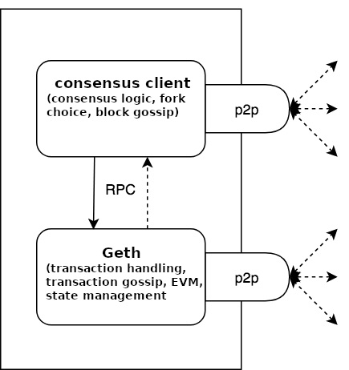

# 以太坊节点

### 全节点架构

- 共识客户端（信标链）

- 执行客户端（geth）

官网文档： https://ethereum.org/zh/developers/docs/nodes-and-clients/run-a-node/

ethub: https://docs.ethhub.io/using-ethereum/running-an-ethereum-node/

nimbus: https://nimbus.guide/quick-start.html

### beacon(共识层)

api:  https://github.com/ethereum/beacon-APIs

how to install and run a beacon node:https://www.quicknode.com/guides/infrastructure/how-to-install-and-run-a-prysm-beacon-node

作用： proposal block; handling consensus logic;

### geth(执行层)

api: https://ethereum.github.io/execution-apis/api-documentation

doc: https://geth.ethereum.org/

作用： tranactions handling, evm

### 搭建节点问题汇总

https://blog.csdn.net/Lyon_Nee/article/details/112273194